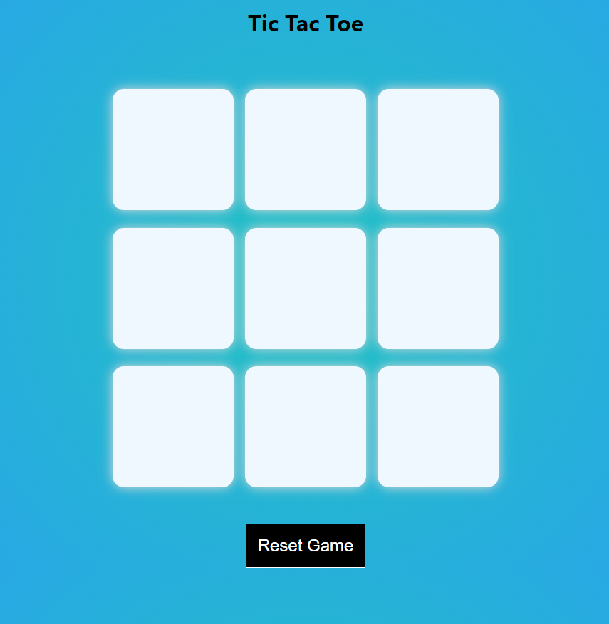
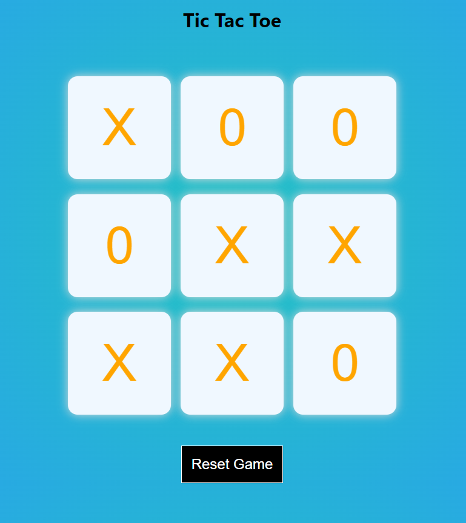

# React Tic Tac Toe App

A simple Tic Tac Toe game built with React.

<!-- ## Demo

[Live Demo](https://your-demo-url.com) -->

## Screenshots




## Getting Started

### Prerequisites

- Node.js and npm installed on your machine.

### Installation

1. Clone the repository:

   ```bash
   git clone https://github.com/95keshav/react-tic-toc-app.git
   ```

2. Navigate to the project directory:

   ```bash
   cd react-tic-toc-app
   ```

3. Install dependencies:

   ```bash
   npm install
   ```

4. Start the development server:

   ```bash
   npm start
   ```

5. Open your browser and visit [http://localhost:3000](http://localhost:3000) to play the game.

## How to Play

- Two players take turns to mark a square with their symbol (X or O).
- The game ends when one player has three of their symbols in a row (horizontally, vertically, or diagonally), or the board is full with no winner.

## Features

- Simple and intuitive user interface.
- Tracks the current player's turn.
- Indicates the winner or a draw at the end of the game.

## Technologies Used

- React

## Contributing

Contributions are welcome! Please open an issue or submit a pull request with any improvements or fixes.

## License

This project is licensed under the MIT License - see the [LICENSE](LICENSE) file for details.
